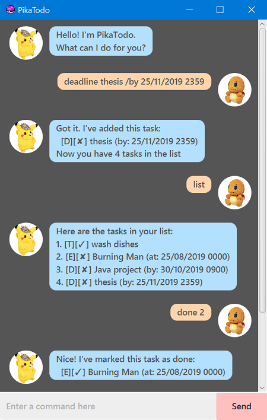

# User Guide



PikaTodo is a simple chat-bot that helps you keep track of your tasks.

## Features 
- Create and add new tasks to a list.
- Categorise each tasks into three different types: to-do, deadline and event.
- Mark a task as done.
- Delete tasks from the list.
- Update the description of a task in the list.
- Find all tasks based on an input.

## Usage

### `list`
**Displays all the tasks in the list.**

Example of usage:
```
list
```

Expected outcome:
```
Here are the tasks in your list:
1. [T][✓] buy a new phone
2. [E][✘] Burning Man (at: 25/08/2019 0000)
3. [D][✘] Java project (by: 30/10/2019 0900)
4. [D][✘] thesis (by: 25/11/2019 2359)
```


### `todo` or `event` or `deadline`
**Creates a todo/event/deadline task and append it to the list.**

The format for each task are as follows
- todo: `todo <description>`
- deadline: `deadline <description> /by <datetimeformat>`
- event: `event <description> /at <datetimeformat>`

Example of usage:
```
todo wash dishes
```

Expected outcome:
```
Got it. I've added this task:
  [T][✘] wash dishes
Now you have 5 tasks in the list
```

### `done <index>`
**Marks as done the task of the provided index.**

Example of usage:
```
done 2
```

Expected outcome:
```
Nice! I've marked this task as done:
  [E][✓] Burning Man (at: 25/08/2019 0000)
```

### `delete <index>`
**Delete the task of the provided index from the list.**
Example of usage:
```
delete 1
```

Expected outcome:
```
Noted. I've removed this task:
  [T][✓] buy a new phone
```

### `find <string>`
**Finds all tasks in the list which contain the provided string.**

Example of usage:
```
find thesis
```

Expected outcome:
```
Here are the tasks in your list:
1. [D][✘] thesis (by: 25/11/2019 2359)
```

### `update <index> w/<description> d/<datetimeformat>`
**Updates the task of provided index with a new description.**

The field date is only mandatory for deadline and event.

Example of usage:
```
update 2 w/Black Rock City d/03/09/2019 0000
```

Expected outcome:
```
Noted. I've edited this task:
  [E][✓] Black Rock City (at: 03/09/2019 0000)
```
### `clear`
**Removes all tasks in the list.**

Example of usage:
```
clear
```

Expected outcome:
```
All tasks cleared!
```

###`help`
**Lists all available commands in the program.**

Example of usage:
```
help
```

Expected outcome:
```
Available commands:
"list"
"done <index>"
"delete <index>"
"find <string>"
"update <index> w/<description> d/<datetimeformat>"
"clear"
"todo <description>"
"deadline <description> /by <datetimeformat>"
"event <description> /at <datetimeformat>"
"bye"
```


### `bye`
**Terminates the program and exits.**

Example of usage:
```
bye
```